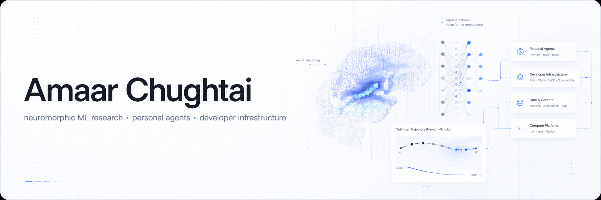

<p align="center">
  <picture>
    
  </picture>
</p>

<p align="center">
  <a href="https://amaarmc.org">amaarmc.org</a>
  ·
  <a href="https://github.com/amaar-mc/fastmuon-local-research">optimizer research</a>
  ·
  <a href="https://github.com/amaar-mc/graft">code intelligence</a>
  ·
  <a href="https://github.com/amaar-mc/wit">agent coordination</a>
</p>

<p align="center">
  
</p>

## Positioning

I build AI-native systems at the intersection of **neuromorphic ML research**, **personal agents**, and **developer infrastructure**.

Current anchor work:

- **Princeton / MedARC MindEye:** neuromorphic computing research for real-time neural decoding with fMRI, DNNs, and transformer-based vision models.
- **null0.ai:** a sandboxed AI clone that connects to your platforms, learns your context, and operates on your behalf.
- **FastMuon:** local optimizer research testing whether reduced-depth Newton-Schulz Muon variants preserve sample-efficiency gains.

## Work Grid

<table>
  <tr>
    <td width="50%" valign="top">
      <h3>Neuromorphic ML Research</h3>
      <p><strong>Princeton · MedARC MindEye · fMRI → vision models</strong></p>
      <p>Researching real-time visual perception decoding by aligning brain activity with deep vision models. Current threads include TR-by-TR inference, retrieval/reconstruction metrics, fast voxelwise beta estimation, and subject-specific model adaptation.</p>
      <p>
        
        
        
        
      </p>
      <p>
        
        
        
      </p>
    </td>
    <td width="50%" valign="top">
      <h3>null0.ai</h3>
      <p><strong>sandboxed AI clone · personal context · platform actions</strong></p>
      <p>Building a macOS beta that consolidates messages, relationships, and workflows into one hub. The core idea is a personal agent that understands your context and acts across the platforms you already use.</p>
      <p>
        
        
        
      </p>
      <p>
        
        
        
      </p>
    </td>
  </tr>
  <tr>
    <td width="50%" valign="top">
      <h3>Optimizer Research</h3>
      <p><strong>FastMuon · Newton-Schulz depth · PyTorch sweeps</strong></p>
      <p>Built a local research harness for Muon-family optimizers. First signal: NS3/NS4 reduced-depth Muon preserved much of Muon's small-LLM validation-loss improvement while using fewer Newton-Schulz iterations.</p>
      <p>
        <a href="https://github.com/amaar-mc/fastmuon-local-research">
          
        </a>
        
        
      </p>
      <p>
        
        
      </p>
    </td>
    <td width="50%" valign="top">
      <h3>Agent Infrastructure</h3>
      <p><strong>MCP · codebase context · coordination protocols</strong></p>
      <p>Working on local-first code intelligence and coordination layers for coding agents: dependency graphs, symbol-aware context, declared intents, locks, and conflict detection before agents edit the same code.</p>
      <p>
        <a href="https://github.com/amaar-mc/graft">
          
        </a>
        <a href="https://github.com/amaar-mc/wit">
          
        </a>
        
      </p>
      <p>
        
        
        
      </p>
    </td>
  </tr>
  <tr>
    <td width="50%" valign="top">
      <h3>AI Automation Systems</h3>
      <p><strong>n8n · operations workflows · model evaluation</strong></p>
      <p>Designed production automations for operations, finance, routing, and AI-assisted decision support. Also built evaluation workflows for model behavior, prompt reliability, and agentic workflow consistency.</p>
      <p>
        
        
        
      </p>
      <p>
        
        
        
      </p>
    </td>
    <td width="50%" valign="top">
      <h3>Consumer AI Products</h3>
      <p><strong>Cotton · wardrobe AI · outfit generation</strong></p>
      <p>Founded Cotton, an AI closet product for clothing detection, outfit generation, and personal styling. The work spans product vision, AI integration, growth, fundraising, and team execution.</p>
      <p>
        
        
        
      </p>
      <p>
        
        
        
      </p>
    </td>
  </tr>
</table>

## Tooling

<p>
  
  
  
  
  
  
  
  
  
  
  
  
  
  
  
  
  
  
</p>

## Operating Principle

```txt
Research what matters.
Build the sharp prototype.
Measure it honestly.
Ship the parts that survive contact with reality.
```
