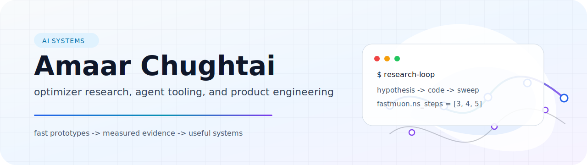

<picture>
  <source media="(prefers-color-scheme: dark)" srcset="./assets/profile-hero-dark.svg">
  <source media="(prefers-color-scheme: light)" srcset="./assets/profile-hero-light.svg">
  
</picture>

<p align="center">
  <a href="https://amaarmc.org">website</a>
  ·
  <a href="https://github.com/amaar-mc/fastmuon-local-research">optimizer research</a>
  ·
  <a href="https://github.com/amaar-mc/graft">code intelligence</a>
  ·
  <a href="https://github.com/amaar-mc/wit">agent coordination</a>
</p>

## About

I build AI-native systems: research prototypes, developer tools, and product-grade web software. My current work is centered on optimizer efficiency, local-first code intelligence, and coordination protocols for AI coding agents.

I care about the whole path from idea to evidence: implement the sharp version, measure it honestly, and turn the parts that survive into usable systems.

## Current Focus

| Thread | What I am testing |
|---|---|
| **Optimizer research** | Whether Muon-style optimizers can preserve sample-efficiency gains with fewer Newton-Schulz iterations. |
| **Agent tooling** | Local codebase context, symbol-aware coordination, and conflict detection before agents touch the same code. |
| **AI-native products** | Interfaces where models are part of the system architecture, not a feature added at the end. |

## Selected Work

| Project | Notes |
|---|---|
| [fastmuon-local-research](https://github.com/amaar-mc/fastmuon-local-research) | Local PyTorch research lab for Muon-family optimizers. First signal: **FastMuon-NS3/NS4** preserved much of Muon's small-LLM gain with fewer Newton-Schulz iterations. |
| [graft](https://github.com/amaar-mc/graft) | Local-first codebase context engine for AI coding tools via MCP. TypeScript, static analysis, tree-sitter, dependency graphs. |
| [wit](https://github.com/amaar-mc/wit) | Agent coordination protocol: declare intents, lock symbols, and detect conflicts before code is written. |
| [awesome-cli-coding-agents](https://github.com/amaar-mc/awesome-cli-coding-agents) | Curated directory of terminal-native AI coding agents and orchestration harnesses. |
| [harmoniq-site](https://github.com/amaar-mc/harmoniq-site) | Product/frontend work in TypeScript. |

## Toolkit

| Area | Tools |
|---|---|
| AI / research | Python, PyTorch, TensorFlow, NumPy, scikit-learn, NLP |
| Systems | TypeScript, Rust, C++, Java, tree-sitter, MCP, CLIs |
| Product | Next.js, Svelte, Vue, Supabase, PostgreSQL, HTML/CSS |

## How I Work

```txt
Prototype quickly.
Prefer measurements over aesthetics.
Keep the interface simple enough to survive real use.
```

## Contact

The best starting point is [amaarmc.org](https://amaarmc.org). For code, research, and open-source work, the relevant projects are linked above.

